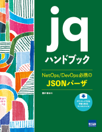

# jqDoc-public

「jqハンドブック」（カットシステム、2021年7月）の目次、掲載サンプルファイル、関数等のリストを乗せた[付録C](./sectionC-list.md)を公開しています。

ご購入はこちらから: 【
[出版社から](http://www.cutt.co.jp/book/978-4-87783-491-3.html) |
[honto](https://honto.jp/netstore/pd-book_31037910.html) |
[amazon.co.jp](https://www.amazon.co.jp/jqハンドブック―NetOps-DevOps必携のJSONパーザ-豊沢聡/dp/4877834915)
】

## 目次

- はじめに
	- 注意事項
		- 表記
		- 配列要素番号
		- サンプルファイル
		- jqのバージョン
		- Windowsでの利用
- 第1章 はじめよう
	- 1.1 jqの実行
		- 1.1.1 コマンドの書式
		- 1.1.2 フィルタの保護
		- 1.2.3 不正なJSONテキスト
	- 1.2. フィルタ
		- 1.2.1 アイデンティティ
		- 1.2.2 オブジェクトへのパス
		- 1.2.3 特殊なプロパティ名
		- 1.2.4 配列要素へのパス
		- 1.2.5 イテレータ
	- 1.3 コマンドオプション
		- 1.3.1 バージョン
		- 1.3.2 インデント幅の変更
		- 1.3.3 ダブルクォートを外す
		- 1.3.4 コンパクト出力
		- 1.3.5 連結
		- 1.3.6 Unicodeの表示
		- 1.3.7 配色の変更
		- 1.3.8 プロパティ名のソート
		- 1.3.9 複数のオプション
	- 1.4 まとめ
- 第2章 入出力
	- 2.1 入力
		- 2.1.1 複数のファイル
		- 2.1.2 複数のJSONテキスト
		- 2.1.3 複数のJSONをまとめる
		- 2.1.4 slurpの挙動
		- 2.1.5 標準入力
		- 2.1.6 プログラムの出力を処理
		- 2.1.7 無入力
		- 2.1.8 入力を文字列として扱う
		- 2.1.9 JSONテキストシーケンス
	- 2.2 フィルタファイル
	- 2.3 終了コード
		- 2.3.1 終了コードの変更
		- 2.3.2 その他の終了コード
	- 2.4 出力文字の変換
	- 2.5 まとめ
- 第3章 フィルタの基本
	- 3.1 角カッコ
		- 3.1.1 負の要素番号
		- 3.1.2 配列のスライス
		- 3.1.3 文字列のスライス
		- 3.1.4 配列の生成
		- 3.1.5 配列の配列
	- 3.2 カンマ
		- 3.2.1 複数の配列要素の抽出
		- 3.2.2 複数のオブジェクトの抽出
		- 3.2.3 直値の指定
	- 3.3 パイプ
	- 3.4 疑問符
	- 3.5 中カッコ
	- 3.6 ダブルドット
	- 3.7 まとめ
- 第4章 データ型と基本演算
	- 4.1 演算子と関数
		- 4.1.1 演算子の引数
		- 4.1.2 関数の引数
		- 4.1.3 処理順序
	- 4.2 データ型
		- 4.2.1 データ型の確認
		- 4.2.2 特定のデータ型だけ抽出
		- 4.2.3 文字列から数値への変換
		- 4.2.4 文字列への変換
		- 4.2.5 文字列表記のオブジェクトと配列
	- 4.3 加算と減算
		- 4.3.1 加算
		- 4.3.2 加算の制約
		- 4.3.3 nullの加算
		- 4.3.4 減算
	- 4.4 型依存の関数
		- 4.4.1 length
		- 4.4.2 add
		- 4.4.3 sort
		- 4.4.4 sort_by
		- 4.4.5 maxとmin
	- 4.5 代入
		- 4.5.1 演算結果の代入
		- 4.5.2 存在しない要素への代入
		- 4.5.3 更新代入
		- 4.5.4 算術更新代入
	- 4.6 まとめ
- 第5章 数値演算
	- 5.1 乗除算
		- 5.1.1 浮動小数点版モジュロ
	- 5.2 丸め処理
		- 5.2.1 切り上げ
		- 5.2.2 切り捨て
		- 5.2.3 最接近丸め
		- 5.2.4 0への丸め
	- 5.3 数値の分解
		- 5.3.1 絶対値
		- 5.3.2 整数部分と小数点部分への分解
		- 5.3.3 符号の転写
	- 5.4 その他の数学関数
		- 5.4.1 最大値と最小値
		- 5.4.2 指数関数
		- 5.4.3 対数関数
		- 5.4.4 三角関数
	- 5.5 数列の生成
	- 5.6 日時関数
		- 5.6.1 現在の日時
		- 5.6.2 Unixエポックと文字列表記の相互変換
		- 5.6.3 日時の分解
		- 5.6.4 カスタム日時文字列
	- 5.7 数値定数
		- 5.7.1 無限大
	- 5.8 数値の精度
	- 5.9 まとめ
- 第6章 文字列操作
	- 6.1 基本操作
		- 6.1.1 乗算
		- 6.1.2 部分文字列
		- 6.1.3 バイト長
		- 6.1.4 Unicodeコード
		- 6.1.5 大文字小文字化
		- 6.1.6 文字列の分割と連結
		- 6.1.7 文字位置の検索
	- 6.2 正規表現
		- 6.2.1 使用上の注意
		- 6.2.2 パターンマッチ文字列
		- 6.2.3 正規表現関数の引数
		- 6.2.4 test
		- 6.2.5 match
		- 6.2.6 matchとキャプチャ
		- 6.2.7 matchと名前つきキャプチャ
		- 6.2.8 capture
		- 6.2.9 scan
		- 6.2.10 splits
		- 6.2.11 subとgsub
	- 6.3 まとめ
- 第7章 配列操作
	- 7.1 要素の抽出
		- 7.1.1 位置から抽出
		- 7.1.2 個数から抽出
		- 7.1.3 値から番号を抽出
		- 7.1.4 バイナリサーチ
	- 7.2 配列の変形
		- 7.2.1 平板化
		- 7.2.2 重複の除外
		- 7.2.3 逆順
		- 7.2.4 削除
		- 7.2.5 組みあわせ
		- 7.2.6 転置
	- 7.3 シーケンス処理
		- 7.3.1 map
		- 7.3.2 reduce
	- 7.4 まとめ
- 第8章 オブジェクト操作
	- 8.1 オブジェクト操作
		- 8.1.1 キー抽出
		- 8.1.2 削除
		- 8.1.3 重複の除外
		- 8.1.4 シーケンス処理
	- 8.2 キーと値の同時処理
		- 8.2.1 to_entries
		- 8.2.2 to_entriesと配列
		- 8.2.3 from_entries
		- 8.2.4 with_entries
	- 8.3 パス配列
		- 8.3.1 生成
		- 8.3.2 値の取得
		- 8.3.3 値のセット
		- 8.3.4 削除
	- 8.4 まとめ
- 第9章 比較演算子、論理演算子、述語関数
	- 9.1 比較演算子
		- 9.1.1 等値
		- 9.1.2 大小関係
	- 9.2 論理演算子
		- 9.2.1 論理和と論理積
		- 9.2.2 否定演算子
		- 9.2.3 排他論理和
	- 9.3 述語関数
		- 9.3.1 文字列用
		- 9.3.2 数値用
		- 9.3.3 配列用
		- 9.3.4 汎用
	- 9.4 まとめ
- 第10章 制御構造
	- 10.1 条件分岐
		- 10.1.1 if文
		- 10.1.2 select
		- 10.1.3 代替演算子
	- 10.2 エラー処理
		- 10.2.1 try-catch
		- 10.2.2 エラー抑制演算子
		- 10.2.3 強制終了
		- 10.2.4 強制エラー
	- 10.3 変数
		- 10.3.1 変数定義
		- 10.3.2 コマンドラインからの変数設定
		- 10.3.3 ファイルを変数に代入
		- 10.3.4 変数を用いたinとinside
		- 10.3.5 環境変数
	- 10.4 関数定義
	- 10.5 ループ
		- 10.5.1 while
		- 10.5.2 until
		- 10.5.3 foreach
	- まとめ
- 付録A インストール
	- A.1 実行形式のインストール
		- A.1.1 パスの設定
	- A.2 Windows Subsystem for Linuxの導入
		- A.2.1 実行
		- A.2.2 ドライブ
		- A.2.3 同名のコマンドについて
- 付録B JSON
	- B.1 JSONとは
	- B.2 JSONテキスト
		- B.2.1 文字
		- B.2.2 文字列
		- B.2.3 数値
		- B.2.4 真偽値
		- B.2.5 null
		- B.2.6 空白文字
		- B.2.7 オブジェクト
		- B.2.8 オブジェクトのプロパティ
		- B.2.9 プロパティの命名規則
		- B.2.10 配列
	- B.3 JSONファイル
- 付録C [関数一覧](./sectionC-list.md "REFERENCES")
	- C.1 コマンドオプション
	- C.2 特殊記号
	- C.3 演算子
	- C.4 関数
	- C.5 数学関数
	- C.5 定数、特殊変数
- 付録D 参考文献
- 著者プロフィール

## 著者近影

